# Cheese & Cream: Codex Cat Pets

Two fluffy companions based on real cats. Cheese has a ginger coat and a cream muzzle. Cream has long white fur, round eyes, and a tiny pink nose. Install both as custom Codex pets on macOS or Windows.

## Install in Codex

### [Install Cheese or Cream →](https://SeanBaek111.github.io/codex-cat-pets/)

Open the installation page, choose **Install Cheese in Codex** or **Install Cream in Codex**, and allow your browser to open Codex. Review and complete the installation in the app.

No ZIP extraction or installer script is needed for this method. Codex must already be installed and support pet installation links. GitHub blocks direct `codex://` links in README files, so these buttons are hosted on the installation page.

| Cheese | Cream |
| --- | --- |
| 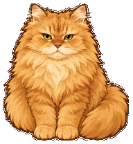 | 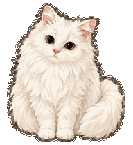 |

## Meet the cats

| Cheese | Cream |
| --- | --- |
| 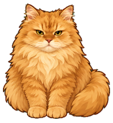 | 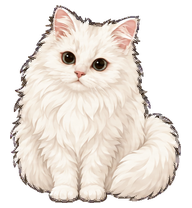 |
| A fluffy ginger cat with a cream muzzle | A white longhaired cat with a pink nose |

## Animation gallery

| Animation | Cheese | Cream |
| --- | --- | --- |
| Resting and blinking | 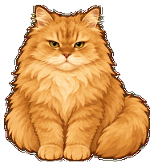 | 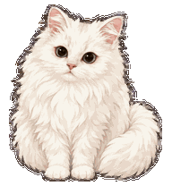 |
| Running | 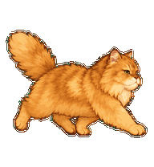 | 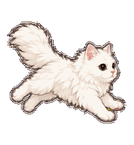 |
| Jumping | 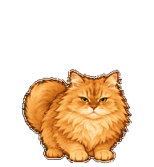 | 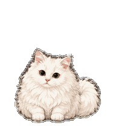 |
| Looking in 16 directions | 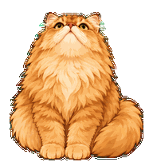 | 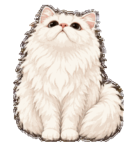 |

Each pet includes nine animation states: idle, running left, running right, waving, jumping, failure, waiting for input, working, and reviewing. The gallery uses frames from the distributed spritesheets. These are looping asset previews, not recordings of the app.

## Download

**[Download both pets as a ZIP](https://github.com/SeanBaek111/codex-cat-pets/releases/latest/download/codex-cat-pets.zip)**

This repository is public. No GitHub login or Git installation is needed. Extract the ZIP to find both pets and the macOS and Windows installers. [View the latest release](https://github.com/SeanBaek111/codex-cat-pets/releases/latest).

## Install on macOS

For the ZIP installer, open Terminal, type `bash `, drag `install-mac.command` from the extracted folder into the Terminal window, and press Return. Administrator access is not required. macOS may block double-clicking this unsigned script; the installation page above opens the native Codex installation flow instead.

## Install on Windows

Choose **Extract All** on the ZIP, then double-click `install-windows.cmd` in the extracted folder.

The installer uses built-in Windows PowerShell. No extra packages or administrator access are required. Its execution-policy override applies only to that process. If your organization's policy blocks scripts, use the manual installation instructions below.

## Choose your pet

Open **Settings > Pets** in the app and choose **Cheese** or **Cream**. If they do not appear, fully quit and reopen the app. You need a desktop app version that supports custom pets. See the [official settings guide](https://learn.chatgpt.com/docs/reference/settings#pets).

## Manual installation

Copy the `pets/cheese` and `pets/cream` folders to the following location:

| Platform | Default destination |
| --- | --- |
| macOS | `~/.codex/pets/` |
| Windows | `%USERPROFILE%\.codex\pets\` |

Keep `pet.json` and `spritesheet.webp` together inside each pet folder. If your app uses a custom `CODEX_HOME`, copy the folders into its `pets` directory instead. For the native Windows app, use the Windows user directory rather than a WSL home directory.

The installers honor `CODEX_HOME`. You can also specify a custom location directly:

```sh
bash install-mac.command '/path/to/codex-home'
```

```powershell
powershell -NoProfile -ExecutionPolicy Bypass -File .\install-windows.ps1 -CodexHome 'D:\CodexHome'
```

The installers verify file checksums before copying anything. Existing pets with the same IDs are backed up under `pet-backups`. Other pets and app settings are left unchanged.

## Package details and validation

- Each pet uses a transparent 1536 x 2288 WebP spritesheet, the v2 format, nine animation states, and 16 look directions.
- Original photographs and local working records are not included.
- Both spritesheets passed asset validation and visual review.
- macOS installation tests passed, including paths with spaces, backups, and rejection of corrupted downloads.
- A Windows PowerShell installer and matching tests are included. They have not been executed on Windows. Run `python -m unittest discover -s tests -v` to run the tests. Python is needed only for testing, not installation.
- Installer tests do not verify playback inside the app. Playback on other computers has not been tested.

These custom pets were created from photo references using imagegen and hatch-pet. They are not official OpenAI characters.
